###1. Git concept

- Git is not only Version Control System(VCS) but also Distributed Version Control(DVC)

  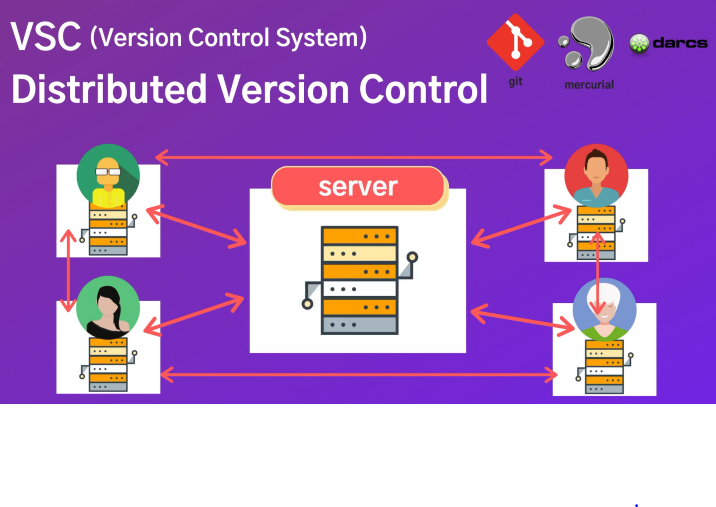
  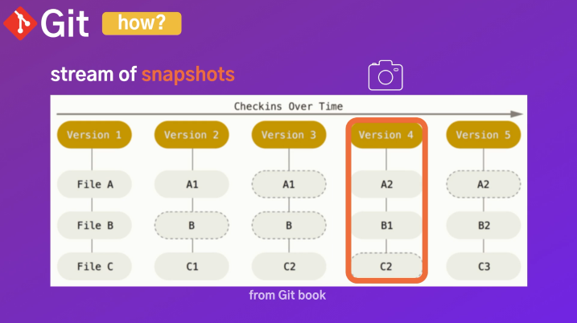

- Git workflow could be devided below

  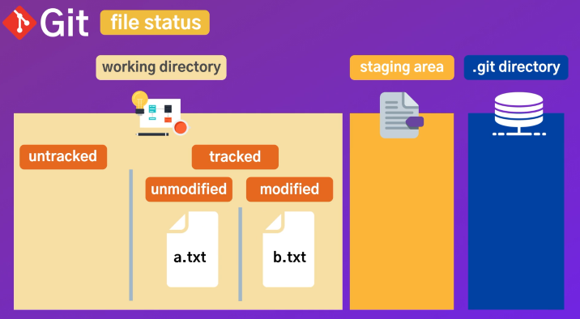

- Git could restore file from commit to untracked on working directory.

  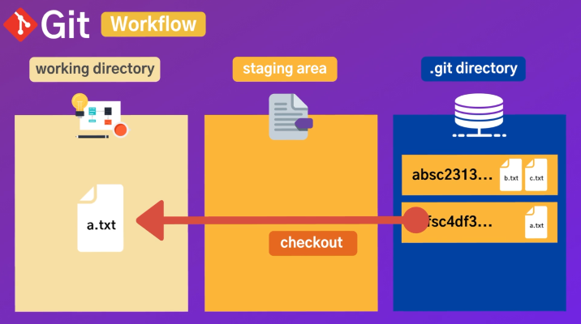

- Commit include hash code based on snapshot information and this help we could reference version. move file from staging area to .git directory with saving history

- Git could upload on remote storage

  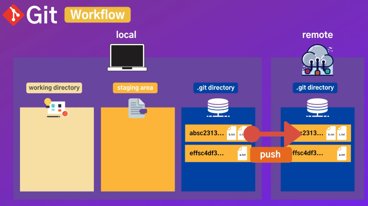

- Git could download from remote storage

  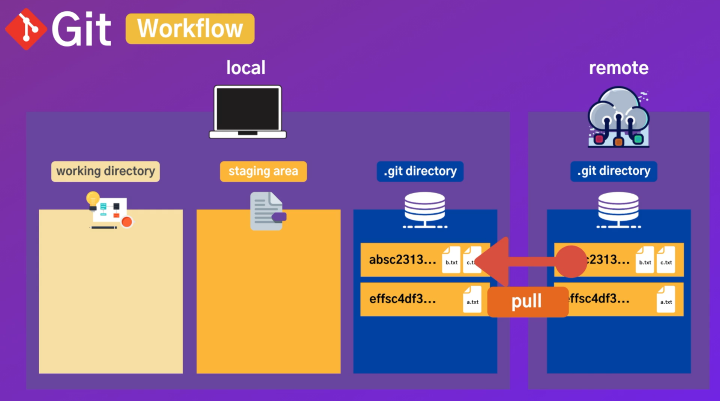

###2. Why use Git

- Most commonly used
- Free
- Open source
- All activities fast
- Work offline when server error
- Undo mistakes
- Easy and fast branching/merging
- Better cooperation with making branches per function

###3. Basic git commands

1. Config

- `git config --list`: Show me all setting list
- `q`: exit and come back to terminal
- `git config --global core.editor "code"`: Setting on using terminal when executing vscode
- `git config --global core.editor "code --wait"`: Setting on using terminal when exiting vscode
- `git config --global -e`: Edit setting with vscode
- `code .`: Connection with vscode
- `git config --global user.name "Matthew530419"`: Setting user information for name
- `git config --global user.email "sprite530@naver.com"`: Setting user information for email
- `git config user.name`: Check user name
- `git config user.email`: Check user email
- `git config --global core.autocrlf input`: Change the line on OS(window or Mac) efficiently when using git repository
- `git config --global alias.st status`: Use keyword instead of full sentence
- `git config --global alias.hist "log --graph --all --pretty=format:'%C(yellow)[%ad]%C(reset) %C(green)[%h]%C(reset) | %C(white)%s %C(bold red){{%an}}%C(reset) %C(blue)%d%C(reset)' --date=short"`: Setting colorful git log and Use keyword
- `git config --h`: Check help means command and option regarding configration

2. Getting and Creating project

- `git init`: Initialize empty git repository

3. Basic snapshotting

- `ls -al`: Check lists on current directory
- `ls`: Check lists on current branch
- `rm -rf git`: Cancel git init
- `git status`: Check git status
- `git status --h`: Check help means command and option regarding status
- `git status --s`: Show status concisely
- `git diff -h`: Check help means command and option regarding diff **why not --h?**
- `echo hello world! > a.txt`: make a.txt with "hello world!" sentence on untracked condition
- `echo style > style.css`: make style.css with "style" sentence on untracked condition
- `echo log > log.log`: make log.log with "log" sentence on untracked condition
- `echo *.log > .gitignore`: ignore all files with ".log" extension
  `echo build/*.log > .gitignore`: ignore all files with ".log" extension on "build" subdirectory
- `git add <file>`: moving file from untracked on working directory to staging area. `git add *` means all file move
- `git rm --cached <file>`: moving file from staging area to untracked on working directory
- `start .git`: open folder of named ".git" on window OS. If Mac OS, use `open .git`
- `git diff`: Compare with before and after on working directory. before means file on staging area "new file: " and after means file on tracked on working directory "modified: "

  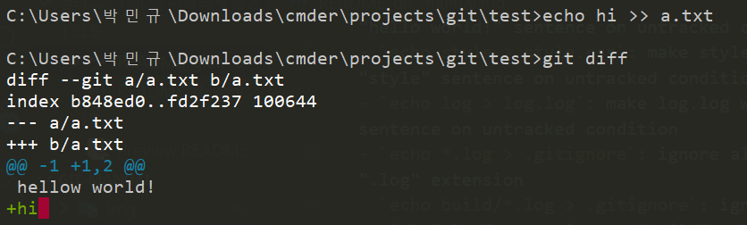

  `--- a/a.txt` means before file condition
  `+++ b/a.txt` means after file condition
  `@@ -1 hellow world!` means look before file first line and check written down hellow world!
  `+1, 2 @@ +hi` means add another line and check written down hi, and then, total lines become 2 lines. +hi is green color because of adding
  If you diff file on staging area, use `git diff --staged` same ad `git diff --cached`

  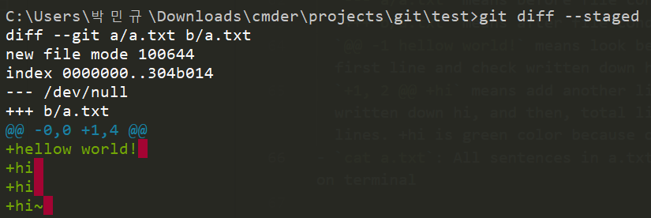

  `--- /dev/null` means no file before
  `git diff <hashcode1> <hashcode2>`: Compare and display only modified contents between hashcode1 and hashcode2. Hashcode1 means before and hashcode2 means after. If you use hashcodes in opposit sequence, you can see '-' with red color, instead of '+' with green color

- `cat a.txt`: All sentences in a.txt are displayed on terminal
- `git rm <file>`: File will be deleted and changes will be updated on staging area(committed). If you use `rm <file>`,changes will be updated on workingdirectory(not committed)
- `git mv <file>`: File will be renamed and changes will be updated on staging area. If you use `mv <file>`,changes will be updated on workingdirectory

###4. Branch

1. concept

- Main or Master: These branches are used when verified functions and production level
- Feature-A/B/C: These branches are used when developing new functions. If you finish to veryfied with relative department, feaure-A/B/C could be merged into main or master.
- Head: Pointing to up-to-date commit and the tip of current branch

  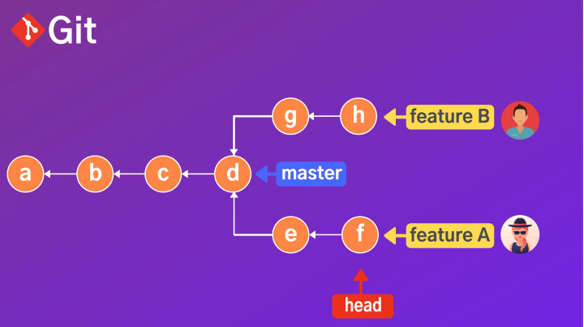

2. git commands

- `git branch`: Check local branches. If depository is connected with remote server, Use `git branch --all`
- `git branch <name>`: Creat new branch named "<name>"
- `git switch <name>`: Move to branch named "<name>"
- `git siwtch -C <name>`: Creat new branch named "<name>" and move to there. It is similar to `git checkout -b <name>`
- `git checkout <hashcode>`: move to the certain commit version. If you move to the certain branch, use `git checkout <name>`. It is similar to `git switch <name>`
- `git branch -v`: Check up-to-date commit per branch
- `git branch --merged`: Check merged branches on current branch. If there is no any other commit after creating branch, that branch would display with merged branches
- `git branch --no-merged`: Check no merged branches on main or master branch
- `git merge <name>`: Merge branch named "<name>" into current branch
- `git branch -d <name>`: Delete branch named "<name>" on fully merged condition
- `git branch -D <name>`: Delete branch named "<name>" on not fully merged condition
- `git push origin -d <name>`: Delete branch named "<name>" on remote repository connected with server
- `git branch --move <name1> <name2>`: Change branch named "<name>" from <name1> to <name2>
- `git push --set-upstream origin <name1>`: Change branch named "<name>" to <name1> on remote repository connected with server
- `git log main..<name>`: Check the log from main branch to "<name>" branch that have been commited. Use not only `git hist main..<name>` if you want to see history, but also `git diff main..<name>` if you want to see modified codes

3. Merge

- Fast forward(ff) merges: Merge simply after HEAD(pointer) move to what branch you want to merge, using `git merge <name>`. However, there isn't any record of history about the merge. It seems to be committing continuously using one branch by one developer
- Option no-ff merges: Use `git merge --no-ff <name>` if you want to record of the merge, and then, Please delete branch named "<name>" after finished the merge
- Three way merges: Auto-merge with record as no-ff even though other commit exist, not between branches that you want to merge. Use `git merge <name>`
- Rebase: In case of three way merges pre-conditions, if you want ff merges, Use . However, If you cooperate with other developer on same branch, path would be different, so there would be conflict when the merge. Do not rebase in case of uploaded history on server. commonly use when the commit on local
- `git merge <name>`: Merge branch named "<name>" into main or master branch concisely. Please delete branch named "<name>" after finished the merge, using `git branch -d <name>`

4. Conflict

- Conflict could appear when same file exist on more than 2 branches and then merge among with those branches
- Resolve conflict manually

  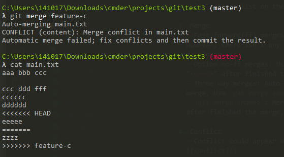

  conflict between modified HEAD and modified <name>. If you use HEAD, delete contents below ====. If you use <name>, delete contents above ====. If you use both, delte <<<HEAD and >>> <name> without sentences.

- Resolve conflict with VS Code
  Use `git config --global -e` and set up the merge as the diff

  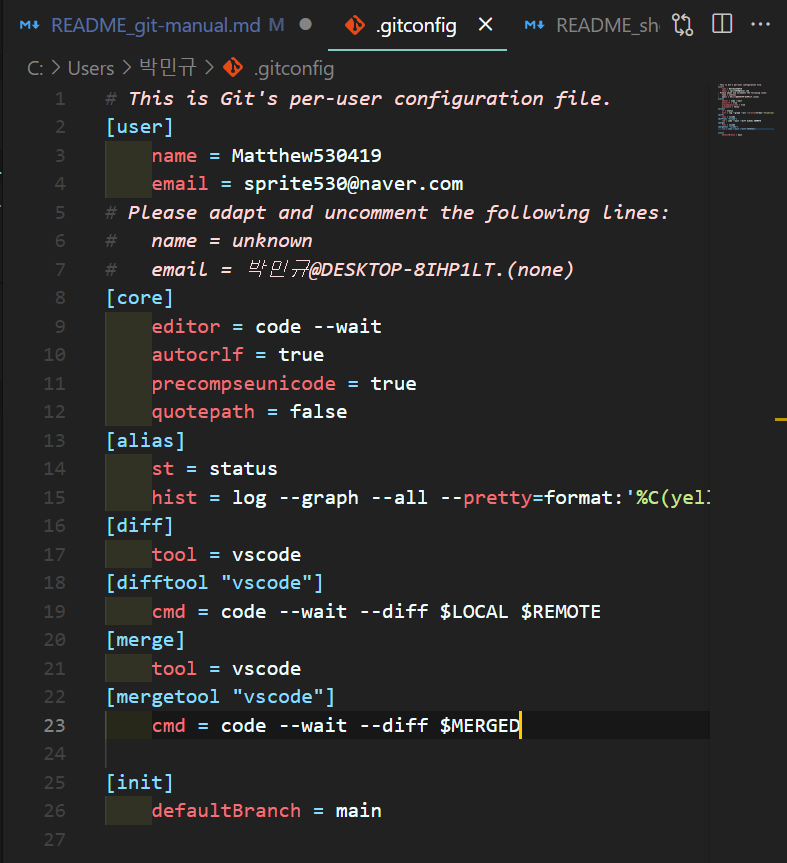
  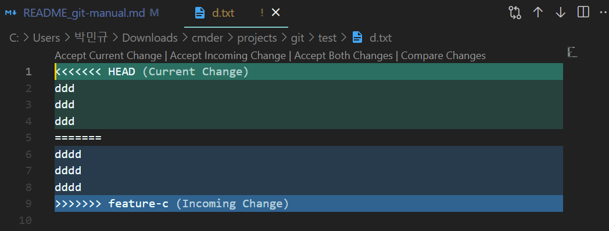

  modified <name> file and <name>.orig appear after the merge. If you do not want to show <name>.orig, use `git config --global mergetool.keepBackup false`. Use `git merge --abort` to go back before the change, and then, `git clean -fd` to delete <name>.orig. you cannot show <name>.orig when try in sequence once again. Use `git merge --continue` to finish the merge

- If commit MSG file on terminal appear when using `git merge --continue` code, please type `:wq`, and then, you can exit the file

  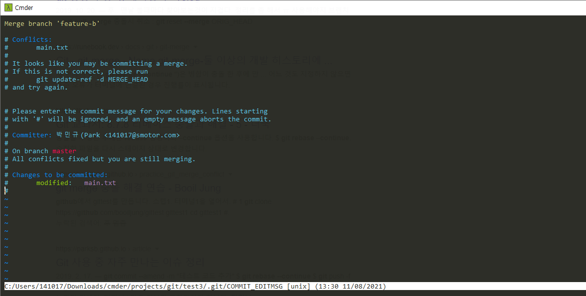

###1. Normal opration

- `renamed:` means `git rm <filename>` and `git add <changed filename>`

  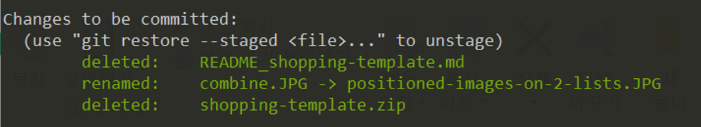

###2. failures

- Local image file was connected with Github. The file was in subdirectory named "img". This was changed information such as name, and then, git didn't recognized with this file and display deleted: when `git status`.
  I couldn't match between this file and git status, however, I found how to recognize this. That was moving this file to root directory. I don't know the reason why git can not recognize this file when any changed information in subdirectory.
