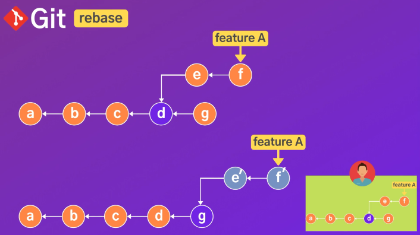

###1. Git concept

- Git is not only Version Control System(VCS) but also Distributed Version Control(DVC)

  \n

  

- Git workflow could be devided below

  

  

- Git could restore file from commit to untracked on working directory

  

- Commit include hash code based on snapshot information and this help we could reference version. move file from staging area to .git directory with saving history

- Git could upload on remote storage

  

- Git could download from remote storage

  

###2. Why use Git

- Most commonly used
- Free
- Open source
- All activities fast
- Work offline when server error
- Undo mistakes
- Easy and fast branching/merging
- Better cooperation with making branches per function

###3. Classified git commands

####1. Config

- `git config --list`: Show me all setting list.
- `q`: exit and come back to terminal.
- `git config --global core.editor "code"`: Setting on using terminal when executing vscode.
- `git config --global core.editor "code --wait"`: Setting on using terminal when exiting vscode.
- `git config --global -e`: Edit setting with vscode.
- `code .`: Connection with vscode.
- `git config --global user.name "Matthew530419"`: Setting user information for name.
- `git config --global user.email "sprite530@naver.com"`: Setting user information for email.
- `git config user.name`: Check user name.
- `git config user.email`: Check user email.
- `git config --global core.autocrlf input`: Change the line on OS(window or Mac) efficiently when using git repository.
- `git config --global alias.st status`: Use keyword instead of full sentence.
- `git config --global alias.hist "log --graph --all --pretty=format:'%C(yellow)[%ad]%C(reset) %C(green)[%h]%C(reset) | %C(white)%s %C(bold red){{%an}}%C(reset) %C(blue)%d%C(reset)' --date=short"`: Setting colorful git log and Use keyword.
- `git config --h`: Check help means command and option regarding configration.

####2. Getting and Creating project

- `git init`: Initialize empty git repository.

####3. Basic snapshotting

- `ls -al`: Check lists on current directory.
- `ls`: Check lists on current branch.
- `rm -rf git`: Cancel git init.
- `git status`: Check git status.
- `git status --h`: Check help means command and option regarding status.
- `git status --s`: Show status concisely
- `git diff -h`: Check help means command and option regarding diff.
- `echo <sentences> <file>.<extension>`: Make <file>.<extension> with <sentences> on untracked condition.
- `echo *.log > .gitignore`: ignore all files with ".log" extension.
  `echo build/*.log > .gitignore`: ignore all files with ".log" extension on "build" subdirectory.
- `git add <file>`: moving file from untracked on working directory to staging area. `git add *` or `git add .` means all file move.
- `git commit -m "message"`: The file would be commited with message and hashcode.
- `git commit --amend -m "message1"`: Commit message would be changed to message1 of up-to-date hashcode. It's possible on not connection with server.
- `git commit --amend`: If you fix only sentences in file keeping commit message, use this code after applying changes to staging area. It's possible on not connection with server.
- `git rm --cached <file>`: moving file from staging area to untracked on working directory.
- `start .git`: open folder of named ".git" on window OS. If Mac OS, use `open .git`.
- `git clean -fd`: Remove untracked files on working directory.
- `git diff`: Compare with before and after on working directory. before means file on staging area "new file: " and after means file on tracked on working directory "modified: "

  

  `--- a/a.txt` means before file condition

  `+++ b/a.txt` means after file condition

  `@@ -1 hellow world!` means look before file first line and check written down hellow world!

  `+1, 2 @@ +hi` means add another line and check written down hi, and then, total lines become 2 lines. +hi is green color because of adding.

  If you diff file on staging area, use `git diff --staged` same ad `git diff --cached`

  

  `--- /dev/null` means no file before

  `git diff <hashcode1> <hashcode2>`: Compare and display only modified contents between hashcode1 and hashcode2. Hashcode1 means before and hashcode2 means after. If you use hashcodes in opposit sequence, you can see '-' with red color, instead of '+' with green color.

- `cat a.txt`: All sentences in a.txt are displayed on terminal
- `git rm <file>`: File will be deleted and changes will be updated on staging area(committed). If you use `rm <file>`,changes will be updated on workingdirectory(not committed).
- `git mv <file>`: File will be renamed and changes will be updated on staging area. If you use `mv <file>`,changes will be updated on workingdirectory.
- `git restore <file>.<extension>`: Restore changers of tracked files on working directory. If you restore all changes, use `git restore .`. Please use this code instead of `git checkout <name>`after git version "2.23", because command `git checkout` implies many command meaning and users are confused. This is the one of breaking down many command meaning `git checkout`.
- `git restore --staged <file>.<extension>`: Restore changers of the file on staging area to on working directory. If you restore all changes, use `git restore --staged .`
- `git restore --staged <file>.<extension>`: Restore changers of files on staging area to working directory. If you restore all changes, use `git restore --staged .`.
- `git restore --source=<hashcode> <file>.<extension>` or `git restore --source=HEAD~<num> <file>.<extension>`: Restore changers of files to the commit with the hashcode or HEAD~<num>.
- `git reset --mixed <hashcode>` or `git reset --mixed HEAD~<num>`:Reset commits from HEAD to right before numbering or from HEAD to right before hashcode. The changers due to resetting would be applied to working directory. If you use `git reset <hasecode>` or `git reset HEAD~<num>`, you will get same output.
- `git reset --soft <hashcode>` or `git reset --soft HEAD~<num>`: :Reset commits from HEAD to right before numbering or from HEAD to right before hashcode. The changers due to resetting would be applied to staging area.
- `git reset --hard HEAD`: Reset completely all tracked files no matter where working directory or staging area.
- `git reset --hard <hashcode>` or `git reset --hard HEAD~<num>`: Reset completely commits from HEAD to right before numbering or from HEAD to right before hashcode. If you restore your fault that come from commits disappear, use `git reset --hard <hashcode>`. The hashcode means right before fault of reset. It would be better to find the hashcode if you use `git reflog`.
- `git reflog`: Check all logs with explanation of status on hashcode with HEAD ID.
- `git revert <hashcode>`: If you want to revert committed files to the original one and the commits connected with server, use this code. This is more safety than `git restore` and `git reset` because this make additional commit log with message and don't change log as them.
- `git revert --no-commit <hashcode>`: If there is a conflict when revert function, use this code, fix the conflict manually and commit. Please just fix and commit about revert without other changers.

####4. Inspection and Finding histories

#####4-1. Log

- 'Log' is very important in aspect of parsing histories and finding what you want.
- `git log`: Check commits in repository. Getting higher, newer, getting lower, older. If you exit history of logs, type `q`.
- `git log -p(--patch)`: Check commits on current branch. You can see updated changer as same as `git diff`.
- `git log --oneline`: Check commits shortly in repository. You can see hasecode, commit message and HEAD only. If you want to see older, use `git log --oneline -- reverse`. If you want to see logs as much as numbering, use `git log --oneline --<number>`.
- `git log --author="<name>"`: If you want to see logs sorted as the author, use this code
- `git log --before="YYYY-MM-DD"`: If you want to see logs before the certain day, use this code
- `git log --grep="key-word"`: If you want to see logs with commit messages, including key-word, use this code
- `git log -S "key-word"`: If you want to see logs with key-word in source code, use this code. If you check key-word in source code, `git log -S "key-word" -p`.
- `git log <file>.<extension>`: If you want to see log with <file>, use this code
- `git log HEAD`: If you want to see logs from HEAD to the oldest, use this code
- `git show <hashcode>`: If you want to see log in detail,including all files on the commit, use this code
- `git show <hashcode>:<file>.<extention>`: If you want to see sentences only on <file>.<extension>, use this code

#####4-2. Tag

- 'Tag' is commly used with platform `v<num1>.<num2>.<num3>`. number1 means an major update in case of adding function, the total updating. number2 means an minor update in case of updating sub function in major function. number3 means an fix update in case of improving parameters on the existing function. If you want to control version like `v<num1>.<num2>`, It is also possible. Please use the platform consistently.
- `git tag v<num1>.<num2>.<num3> <hashcode>`: Record tag on log that you want
- `git tag -l "v<num1>.<num2>.*"`: Search all tags named "v<num1>.<num2>". Just insert _ if you serch all names in form of quote. This form named "v<num1>._" is also possible.
- `git tag -d v<num1>.<num2>.<num3>`: Delete the tag named v<num1>.<num2>.<num3>
- `git checkout v<num1>.<num2>.<num3>`: Move HEAD to the tag named v<num1>.<num2>.<num3>
- `git checkout -b <name> v<num1>.<num2>.<num3>`: Add branch named <name> on tag named v<num1>.<num2>.<num3>

####5. Branching and Merging

#####5-1. Branch

5-1-1. concept

- Main or Master: These branches are used when verified functions and production level
- Feature-A/B/C: These branches are used when developing new functions. If you finish to veryfied with relative department, feaure-A/B/C could be merged into main or master.
- Head: Pointing to up-to-date commit and the tip of current branch

  

5-1-2. git commands

- `git branch`: Check local branches. If depository is connected with remote server, Use `git branch --all`
- `git branch <name>`: Creat new branch named "<name>"
- `git switch <name>`: Move to branch named "<name>". Please use this code instead of `git checkout <name>`after git version "2.23", because command `git checkout` implies many command meaning and users are confused. This is the one of breaking down many command meaning `git checkout`.
- `git siwtch -C <name>`: Creat new branch named "<name>" and move to there. It is similar to `git checkout -b <name>`
- `git checkout <hashcode>`: move to the certain commit version. If you move to the certain branch, use `git checkout <name>`. It is similar to `git switch <name>`
- `git branch -v`: Check up-to-date commit per branch
- `git branch --merged`: Check merged branches on current branch. If there is no any other commit after creating branch, that branch would display with merged branches.
- `git branch --no-merged`: Check no merged branches on main or master branch
- `git merge <name>`: Merge branch named "<name>" into current branch
- `git branch -d <name>`: Delete branch named "<name>" on fully merged condition
- `git branch -D <name>`: Delete branch named "<name>" on not fully merged condition
- `git push origin -d <name>`: Delete branch named "<name>" on remote repository connected with server
- `git branch --move <name1> <name2>`: Change branch named "<name>" from <name1> to <name2>
- `git push --set-upstream origin <name1>`: Change branch named "<name>" to <name1> on remote repository connected with server.
- `git log main..<name>`: Check the log from main branch to "<name>" branch that have been commited. Use not only `git hist main..<name>` if you want to see history, but also `git diff main..<name>` if you want to see modified codes.

#####5-2. Merge

- Fast forward(ff) merges: Merge simply after HEAD(pointer) move to what branch you want to merge, using `git merge <name>`. However, there isn't any record of history about the merge. It seems to be committing continuously using one branch by one developer.
- Option no-ff merges: Use `git merge --no-ff <name>` if you want to record of the merge, and then, Please delete branch named "<name>" after finished the merge.
- Three way merges: Auto-merge with record as no-ff even though other commit exist, not between branches that you want to merge. Use `git merge <name>`, Please delete branch named "<name>" after finished the merge.
- `git merge <name>`: Merge branch named "<name>" into main or master branch concisely. Please delete branch named "<name>" after finished the merge, using `git branch -d <name>`
- Rebase: In case of three way merges pre-conditions, if you want ff merges, Use rebase. However, If you cooperate with other developer on same branch, pointer would be different when he merge, there would be a high possibility of conflict. Do not rebase in case of uploaded history on server. commonly use when the commit on local. You can find details on 5 subject.
- Cherrypick: Use cherrypick if you need a commit about the function using hashcode. First, the commit on certain sub branch would be copied, pasted and merged on not only main branch but also other sub branch with other hashcode. It's also very useful. You can find details on 6 subject.

#####5-3. Conflict

- Conflict could appear when same file exist on more than 2 branches and then merge among with those branches.
- Resolve conflict manually

  

  conflict between modified HEAD and modified <name>. If you use HEAD, delete contents below ====. If you use <name>, delete contents above ====. If you use both, delte <<<HEAD and >>> <name> without sentences.

- Resolve conflict with VS Code
  Use `git config --global -e` and set up the merge as the difftool.

  

  modified <name> file and <name>.orig appear after the merge. If you do not want to show <name>.orig, use `git config --global mergetool.keepBackup false`. Use `git merge --abort` to go back before the change, and then, `git clean -fd` to delete <name>.orig. you cannot show <name>.orig when try in sequence once again. Use `git merge --continue` to finish the merge.

- If commit MSG file on terminal appear when using `git merge --continue` code and not connectied with VS Code, please type `:wq`, and then, you can exit the file.

  

#####5-4. Rebase

- Rebase enable three way merges to be fast forward merges
- Rebase is to save commits of <name2> branch on temp stack and change HEAD to <name1> branch and move and merge the commits on there.
- If you develop same project with other developer, please execute carefully and it's possible to conflict because of difference between pointer when he start to develop and pointer when he merge sub branch to main branch.
- `git rebase <name>`: If ff merges is not possible and you don't want to record history about three way merges, please use this code on subbranch that you want to move commits to main branch. I think this code is effective when only one sub branch chained to main branch.

  

- `git rebase --onto <name1> <name2>`: It's really useful when many sub branches are chained and continue to be listed in parallel. If you change the base and merge commits on sub sub branch into main branch without history, please use this code. <name1> means main or master branch and <name2> means format: sub branch sub sub branch. for example, `git rebase --onto master profile profile-ui`. profile-ui chained to profile and profile chained to main branch.

  

- `git rebase -i <hashcode>`: If you change commit message for hashcode, not the latest commit message, use this code(interactive rebasing) and use hashcode right before, not the hashcode you want to change. Please type r or reword command on git-rebase-todo and save, and then, type what you want on COMMIT-EDITMSG and save.

#####5-5. Cherry-pick

- Cherry-pick enable a commit to be pasted and merged on main branch. If you need one of functions urgently, it's very useful.
- `git ccherry-pick <hashcode>`: Add the one on main branch with creating a new hashcode after one of commits in hashcode was copied on sub branch.

  

#####5-6. Stash

- It's really useful on the conditions below.
  - You are suddenly assinged urgent work when you are coding something else on working directory. You don't like the files to execute commit and want to work after completed urgent work.
  - You want to save the try bug fix files for a while. You don't like the files to execute commit again and You just want to refer for solution of bug fix.
- Temp changes could be stashed and popped between stash stack and working directory.

  

- `git stash`: Stash tracked file to stash stack
- `git stash push -m "message"`: Stash tracked file to stash stack with message
- `git stash push -m "message" --keep-index`: Stash tracked files to stash stack keeping the file on staging area
- `git stash -u`: Stash files to stash stack no matter what is tracked file or untracked file
- `git stash list`: Check stashed list. Getting higher, newer, getting lower, older.
- `git stash drop ID(stash@{num})`: Delete stash of ID on stash stack.
- `git stash clear`: Delete all stashes on stash stack.
- `git stash pop`: Move the latest file from stash stack to working directory, and then, remove the latest ID on stash stack.
- `git stash apply`: Move the latest file from stash stack to working directory, but, stash steal have stash`s ID list.
- `git stash apply ID`: Move the file of ID from stash stack to working directory, but, stash steal have stash`s ID list.
- `git stash show ID`: Check the file having changes on ID briefly.
- `git stash show ID -p`: Check the file having changes in more detail as much as `git diff`.
- `git stash branch <name>`: Move the latest file from stash stack to working directory creating new branch named <name>, and then, remove the latest ID on stash stack.

####6. Methods of updating commit of log in local

#####6-1. Dividing a huge commit in several commits

- First, use `git rebase -i <hashcode>` or `git rebase HEAD~<num>` on right before <hashcode> or right before HEAD~<num>, and then, type `edit` command on git-rebase-todo and save.
- Second, use `git reset --mixed <hashcode>` or `git reset HEAD~<num>` on right before <hashcode> or right before HEAD~<num>, and then, git add <file1> and git commit with <message1>, git add <file2> and git commit with <message2>. Please check whether the logs are properly configured on tree or not.
- Finally, use `git rebase --continue`. You can find that 2 distributed commits are at the place where the huge commit are originally located.

#####6-2. Removal of commits

- Use `git rebase -i <hashcode>` or `git rebase -i HEAD~<num>` on right before <hashcode> or right before HEAD~<num>, and then, type `drop` command on git-rebase-todo and save.
  If you have conflict because shared same file with 2 commits, Please fix the error and use `git rebase --continue`.

#####6-3. Combination of commits

- First, use `git rebase -i <hashcode>` or `git rebase -i HEAD~<num>` on right before <hashcode> or right before HEAD~<num>, and then, type `pick` command on first commit and type `squash` command on the others in git-rebase-todo and save.
- Second, type commit meassage on the commit which is typical of several commits and save on COMMIT_EDITMSG. You can find a typical commit combined several commits.

####7. Resolution of failures

- symptom: `Command syntax is invalid` appear when `git log --graph --all --pretty=format:'%C(yellow)[%ad]%C(reset) %C(green)[%h]%C(reset) |`.
  I think this is over memoryblock apostrophe can use. The memoryblock could save oneline string, but other memoryblock of apostrophe is needed when add `|` or `space`.
  countermeasure: `git log --graph --all --pretty=format:"%C(yellow)[%ad]%C(reset) %C(green)[%h]%C(reset) |`

- symptom: `'git' is not recognized as an internal or external command, operable program or batch file` appear when `git config --global alias.hist "log --graph --all --pretty=format:"%C(yellow)[%ad]%C(reset) %C(green)[%h]%C(reset) | %C(white)%s %C(bold red){{%an}}%C(reset) %C(blue)%d%C(reset)" --date=short"`.
  I think this is not match command format. The correct format is that apostrophe should be inside air quote.
  countermeasure: `git config --global alias.hist "log --graph --all --pretty=format:'%C(yellow)[%ad]%C(reset) %C(green)[%h]%C(reset) | %C(white)%s %C(bold red){{%an}}%C(reset) %C(blue)%d%C(reset)' --date=short"`

- symptom: `error: invalid option: --h` when `git diff -h`.
  I think this is also not command format. command format is different per function according setting. For example, function of diff is only possible `git diff --h`, on the other hand, functions of not only git status but also git config is possible in case of both.

- symptom : `remote: Support for password authentication was removed on August 13, 2021. Please use a personal access token instead.`
  `remote: Please see https://github.blog/2020-12-15-token-authentication-requirements-for-git-operations/ for more information.`
  `fatal: unable to access 'https://github.com/Matthew530419/git-manual.git/': The requested URL returned error: 403`
  This come from expired authentication.
  countermeasure: get personal access token from developer setting from github. Edit password to personal access token on credential manager of windows settings, and then, type `git push` on terminal.

- symptom: `warning: LF will be replaced by CRLF in about.txt. the file will have its original line endings in your working directory.` when `git stash push -m "message" was used at first time.`
  I think windows OS need CRLF, the CRLF applied to at that time, so I haven't seen this warning anymore.

- symptom: `error: could not apply 0e4934b... Add payment-ui` when `git rebase -i e94152f`
  I think same file was used on e94152f and 0e4934b and conflict occurred when deleted e94152f on git-rebase-todo.
  countermeasure: fix all conflict manually and `git add` or `git rm`, and then, `git rebase --continue`

- symptom: Image file cannot be recognized when git status.
  Local image file was connected with Github. The file was in subdirectory named "img". The name of file was changed on local, and then, git didn't recognized with this file and display deleted: when `git status`. This file disappear after git add. There is the file on local directory, but I cannot find the file anywhere when git status. However, I found how to recognize this. That was moving this file to root directory. I don't know the which conditions git cannot recognize file on `untracked files:` of git status.
